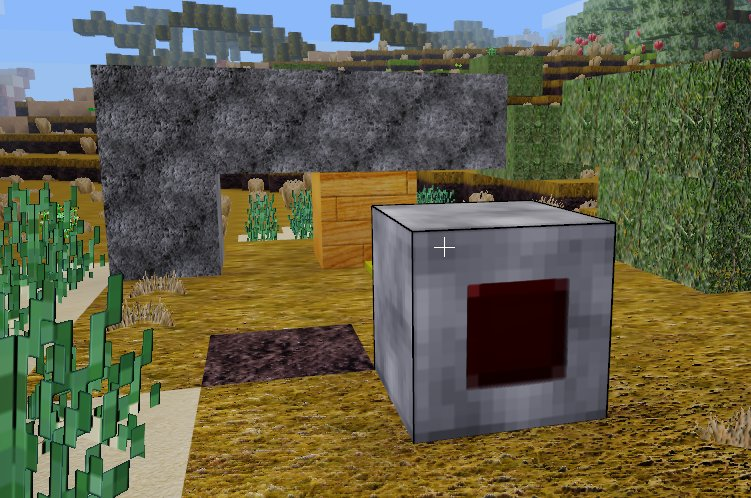
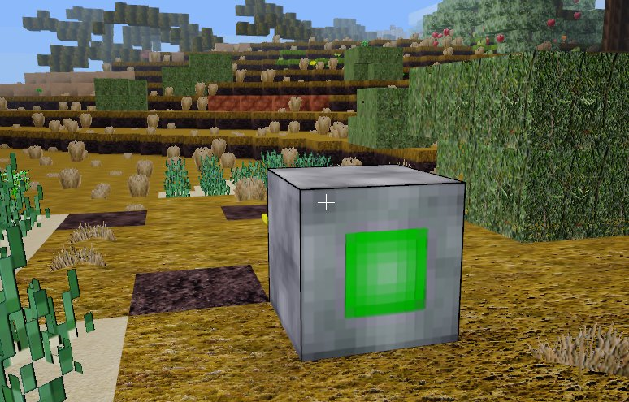

# Mesecons Stealthnode

This mod adds some new ghoststones for mesecons in minetest. 
The function to register your own ghoststones are integrated. 

## No Signal

 

## With Signal

 

## Install

Move your Download to the Mods-Folder. 

## Depends

default 
mesecons_random 

### optional

## Credits
Code to register the ghoststones is taken from jeija's ghoststones.

## License

License: LGPL3.0

